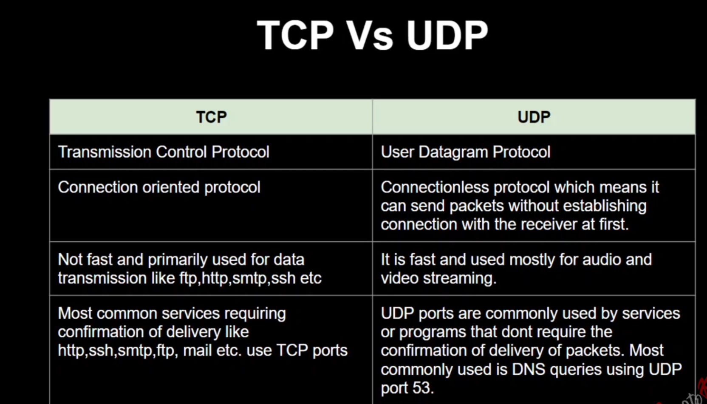
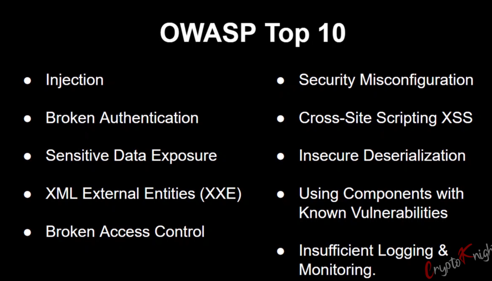

# Cyber-Security

## What is Cybersecurity?

Cybersecurity is a practice to ensure Confidentiality (C), Integrity (I), and Availability (A).

1. **Network Security:**  
   The process of protecting the network from unwanted users, attacks, and intrusions.

2. **Application Security:**  
   Apps require constant updates and testing to ensure these programs are secure from attacks.

3. **Endpoint Security:**  
   Remote access is a necessary part of business, but can also be a weak point for data. Endpoint security is the process of protecting remote access to a company's network.

4. **Data Security:**  
   Inside of networks and applications is data. Protecting company and customer information is a separate layer of security.

5. **Identity Management:**  
   Authentication is an important part of security. Ensuring that only the right people have access to certain information is key.

6. **Database and Infrastructure Security:**  
   Everything in a network relies on the database and infrastructure. Keeping this information secure is a top priority.

7. **Cloud Security:**  
   As more businesses move to the cloud, securing data is an ongoing challenge.

8. **Mobile Security:**
    Mobile devices are now a part of the network. Ensuring these devices are secure is just as important as a desktop.

9. **Disaster Recovery/ Business Continuity Planning:**
    In the event of a breach, natural disaster, or other event, having a disaster recovery plan is essential.


## Networking

**IP Address** .
      1.  Every machine on a network has a unique identifier
      2.  Command to check IP in Linux env ( ifconfig or ip a )
      3.  Command to check IP in Windows env ( ipconfig )
      4.  IPv4 and IPv6
      5.  Public and Private IP

  - Public IP address are always unique across the internet.
  - Private IP address are unique within a network, but not across the internet.


   **IPV4**
  ```bash
      32 bits (4 Octets) - x.x.x.x   x=l octet (1 Octet = 8 bits)
      Example : 192.168.2.4
      192 in binary = 11000000 (8 bits)
      168 in binary = 10101000 (8 bits)
      2 in binary  = 00000010 (8 bits)
      4 in binary = 00000100 (8 bits)
      
      11000000.10101000.00000010.00000100
  ```

  **IPV6**
  ```bash
      8 Groups of Hexadecimal Digits
      128 bits (16 Octets) - x:x:x:x:x:x:x:x
      Example : 2001:0db8:85a3:0000:0000:8a2e:0370:7334
  ```

  **Important IPs**
  ```bash
      -  0.0.0.0: Default Network, which is the abstract concept of just
         being connected to a TCP/IP network.
      
      -  255.255.255.255: Reserved for network broadcasts i.e -
         messages that should go to all computers on the network.
      
      -  127.0.0.1: Loopback address or the computers way of
         identifying itself, whether or not it has an assigned IP address.
  ```

  

   **Important Ports**

   - A network port which is provided by the Transport Layer protocols of Internet
     Protocol suite, such as Transmission Control Protocol (TCP) and User Datagram
     Protocol (UDP) is a number which is serving endpoint communication between two
     computers.
   - Each port number have a distinct service
   - Total Number of ports = 65535
     16 bits


**Ports are classified into 3 main categories**
   
   - **Well Known Ports (Port numbers 0 - 1023)** :
     Well known ports are used by system or processes run by root or with specific
     privileges. The port numbers range from 0 to 1023.
   
   - **Registered Ports (Port numbers 1024 - 49151)** :
     The registered port numbers range from 1024-49151. Such ports are used by
     programs run by users in the system.
   
   - **Private/Dynamic Ports** :
     Private ports are not assigned for any specific purpose. its range are from
     range 49152-65535.

# Kali linux

**Touchup on Languages**

All the files are present in here the one you want to host
```bash
cd /var/www/html
```
To run it in apache server 
navigate to the directory and run
```bash
service apache2 start
```


# Creating custom wordList using a tool (Method 1)
```bash
cewl
```

this tool spiders a given web to a specified depth and creates a wordlist of all the words it finds on the site.

syntax
```bash
cewl -w <output file> -d <depth> -m <minimum length of the word> <url>

```
```bash
cewl -w ./Documents/apple.txt -d 0 -m 6 https://en.wikipedia.org/wiki/Apple_Inc.
```

-w : output file ,
-d : depth ,
-m : minimum length of the word


Word count of the list
```bash
wc -l <filename>
```
-l : line count

Sort the list
Syntax
```bash
sort -u <filename> > <newfilename>
```
-u : unique

Example
```bash
sort -u ./Documents/apple.txt > ./Documents/apple1.txt
```


# Creating custom wordList  (Method 2)

```bash
crunch  
```

Crunch can create a wordlist based on criteria you specify.  The output from crunch can be sent to the screen, file, or to another program.

```bash
crunch <min> <max> [options]
```
Example
```bash
crunch 3 6 abcdefg -o crunchList.txt
```

```bash
@ - lower char
% -Numbers
, - Uppercase
^ - symbols
```


```bash
crunch 4 4 abcdefg123 -t @b%% -o crunchout.txt

this line generates a wordlist that has 4 characters long, with the first character being a lowercase letter, the second being b, and the third and  fourth character being a Number
```





# 5 Phases of Hacking

1 **Reconnaissance** : 
  - Passive Reconnaissance
  - Active Reconnaissance

2 **Scanning** : 
  - Port Scanning
  - Network Scanning
  - Vulnerability Scanning

3 **Gaining Access** :
   - Password Cracking
   - Buffer Overflow
   - Session Hijacking
   - Social Engineering
   - SQL Injection
   - Cross Site Scripting

4 **Maintaining Access** :
   - Rootkits
   - Backdoors
   - Trojans
   - Logic Bombs
   - Viruses
   - Worms

5 **Clearing Tracks** :
   - Log Deletion
   - File Deletion
   - Disabling Auditing
   - Clearing Logs


# Google Dorking

```bash

intext:
eg: intext:computers (searches in text)

inurl:
eg: inurl:admin (whichever results that has admin in the url that would be 
                shown up)

site:
eg: site:google.com

filetype:
eg: cyber security filetype:ppt


intitle:
eg: intitle:cyber(obtains results that has cyber in their title)

Combining

inurl:login site:example.com (searches login in url in example.com)
```

# Command Injection

•  Command injection is an attack in which the goal is execution
   of arbitrary commands on the host operating system via a
   vulnerable application.

•  Command injection attacks are possible when an application
   passes unsafe user supplied data (forms, cookies, HTTP
   headers etc.) to a system shell.


# XSS
Cross Site Scripting (XSS)

• Malicious scripts are injected into otherwise benign and
  trusted websites.

• Types : Reflected XSS, Stored XSS, DOM based XSS

• Sample Payload : 
```bash
  <script>alert(l)</script>
  <script>alert(document.cookie)</script>
```